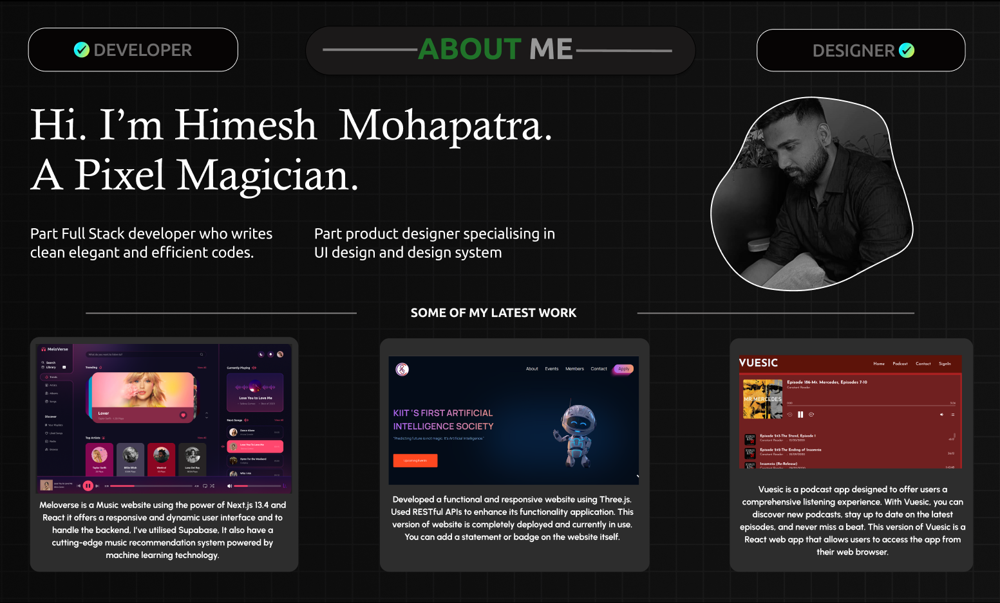

<!--
**himeshez/himeshez** is a ✨ _special_ ✨ repository because its `README.md` (this file) appears on your GitHub profile.

Here are some ideas to get you started:

- 🔭 I’m currently working on ...
- 🌱 I’m currently learning ...
- 👯 I’m looking to collaborate on ...
- 🤔 I’m looking for help with ...
- 💬 Ask me about ...
- 📫 How to reach me: ...
- 😄 Pronouns: ...
- ⚡ Fun fact: ...
-->

 
<h1>  Hey! I'm Himesh Mohapatra </h1>
<h3 align="center">Student at KIIT 👨‍🎓 </h3>
<!-- 👋 -->
 

- 👨🏽‍💻 I’m currently a CSE Undergrad student at KIIT

- 🌱 I’m currently learning DevOps - ☸  Kubernetes ☸

- 📫 How to reach me: **himeshmahapatra@gmail.com**

- 💻 Visit my Linkedin [here](https://www.linkedin.com/in/himesh-mohapatra-386aa8224/)
